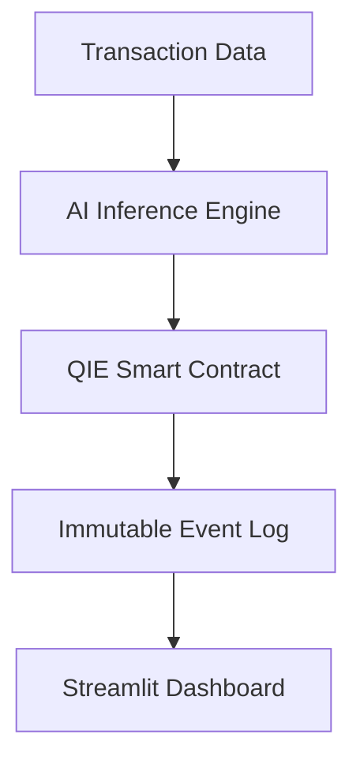

# 🛡️ FraudGuard Labs – AI × Blockchain Fraud Detection 

**An AI-powered fraud detection system that flags high-risk wallets and enables smart-contract–based freezing on QIE Blockchain, ensuring transparent, tamper-proof enforcement of AI decisions.**

## Problem Statement

**Fraud detection remains a critical challenge in digital finance:**

- **Speed**: Manual review is too slow to prevent real-time fraud.  
- **Trust**: Centralized fraud decisions can be disputed.  
- **Scale**: Humans cannot handle modern transaction volumes.  
- **Consistency**: Manual processes lead to inconsistent decisions.  

**Why AI × Blockchain?**  
- AI can detect patterns and assign risk scores.  
- Blockchain ensures **immutable enforcement** of AI decisions.  
- Together: fast, automated, and trustworthy fraud detection.

## Solution Overview

**FraudGuard Labs bridges AI intelligence with blockchain enforcement:**

1. **AI decides (off-chain)**  
   - AI-inspired rule-based inference engine analyzes transaction patterns and assigns **risk scores** (0-100).  
   - Factors: transaction amount, frequency, suspicious time, wallet behavior.  

2. **Blockchain enforces (on-chain)**  
   - Smart contract applies rule-based enforcement (flag / freeze simulation) based on AI risk score.
   - Records all actions immutably on QIE Testnet.  
   - Provides admin interface for **manual unfreeze**.  

3. **Audit Trail**  
   - All fraud detection and enforcement actions are **permanently logged** for transparency.


## AI → Blockchain Decision Bridge

FraudGuard Labs follows a clear separation of responsibilities:

- The AI engine runs **off-chain** and produces a structured decision:
  - `riskScore` (0–100)
  - `recommendedAction` (No Action / Log Only / Freeze)

- The blockchain **never runs AI**.
  Instead, it enforces the AI decision through explicit smart contract calls:
  - `logFraud()` for medium-risk transactions
  - `freezeWallet()` for high-risk wallets

This ensures AI intelligence remains flexible, while blockchain guarantees
trust, enforcement, and immutability.


## System Architecture

The architecture diagram shows logical system components, while the Streamlit dashboard is a simplified demo interface that exposes those components through a single UI.



##  Deployment vs On-Chain Mode

This project supports two modes:

### 🔹 Demo Deployment Mode (Public)
- Used for live deployment
- No private keys
- No real on-chain transactions
- Simulates wallet freezing for safety

### 🔹 On-Chain Enforcement Mode (Testnet)
- Uses QIE Testnet smart contracts
- Signs and submits real transactions
- Logs fraud events immutably on-chain
- Requires environment variables (.env)

The deployed demo focuses on UI + AI flow,
while the repository demonstrates full on-chain enforcement logic.

> Note: The public Streamlit demo runs in safe simulation mode for judging,
while full on-chain enforcement is implemented and verified on QIE Testnet
(see Remix, MetaMask, and transaction screenshots).


**Key Components:**

* **AI Inference Engine** – calculates risk score, suggests actions  
* **Smart Contract** – executes wallet freeze/unfreeze, logs events  
* **Streamlit Frontend** – interactive demo for real-time testing  
* **Immutable Audit Trail** – ensures blockchain trust

## Key Features

### 1️⃣ Demo Mode

* Interactive Streamlit interface for judges  
* "Demo High-Risk Mode" to simulate fraud scenarios  
* Risk visualization: 🟢 Low | 🟠 Medium | 🔴 High

### 2️⃣ AI Risk Scoring

* Analyzes multi-factor transaction data  
* Outputs **risk score** (0-100)  
* Reason for risk flagged clearly in UI

#### Example AI Decision Output

Risk Score: **87**  
Risk Level: **High**

Decision Factors:
- Unusually large transaction amount (+40)
- High transaction frequency in short time window (+30)
- Suspicious activity timing (+17)

Recommended Action: **Freeze Wallet**


### 3️⃣ Blockchain Enforcement

* **logFraud()** → records AI verdict on-chain  
* **freezeWallet()**  → flags wallets as frozen within the smart contract
* **unfreezeWallet()** → admin override  
* **isWalletFrozen()** → check wallet status  
* Events stored for auditability

**On-Chain Events for Auditability**

| Event | Purpose |
|------|--------|
| FraudLogged | Stores AI risk verdict immutably |
| WalletFrozen | Records automated enforcement |
| WalletUnfrozen | Records admin override |


### 4️⃣ Configurable Thresholds

* Risk threshold adjustable via UI (default: 80)  
* Risk Legend:  
  * 🟢 Low: <50 → No action  
  * 🟠 Medium: 50–79 → Log only  
  * 🔴 High: ≥80 → Freeze wallet automatically

### 5️⃣ QIE Testnet Integration

* Real blockchain interaction  
* Fully operational on QIE Testnet  
* Safe demo: no real funds

## Tech Stack

| Layer           | Technology / Tool                    |
| --------------- | ------------------------------------ |
| AI              | Python (rule-based inference engine) |
| Blockchain      | Solidity on QIE Testnet              |
| Frontend / Demo | Streamlit                            |
| Deployment      | Local / Hackathon environment        |
| Security        | Environment variables for keys       |

## How to Run Locally

1. **Install dependencies**

```bash
pip install -r requirements.txt
```

2. **Set up environment variables**

```bash
cp .env.example .env
# Add your demo values (do not commit secrets)
```

3. **Run the app**

```bash
streamlit run app.py
```

4. **Access locally:**  
[http://localhost:8501](http://localhost:8501)

## Security & Safety Considerations

* Private keys **never pushed to GitHub**  
* Demo mode for judges; testnet only  
* Environment variables separate secrets from code  
* Admin controls for wallet unfreeze

## Judge-Friendly Explanation

**FraudGuard Labs directly maps to hackathon criteria:**

1. **Real Problem:** Detects fraudulent or high-risk transactions automatically.  
2. **AI Decision-Making:** Risk scoring and reason generation for automated decisions.  
3. **Blockchain Enforcement:** Smart contract freezes wallets, logs verdicts immutably.  
4. **Runs on QIE:** Fully operational on QIE Testnet, verified via screenshots and transaction hashes.

> Judges see: *AI decides → Smart contract enforces → Transparent, immutable record*

## Contract & Network Info

| Parameter        | Value                                        |
| ---------------- | -------------------------------------------- |
| Contract Address | `0x297dFf53534c4D5aB7043A88a02deF3Ef1fE1e4f` |
| Deployer Wallet  | `0xE080C04E49ac477CeEA993cf0116518BA1fB1a23` |
| Network          | QIE Testnet                                  |


## Important Notes

- This project runs exclusively on QIE Testnet.
- No real funds are moved or locked at any point.
- Wallet “freezing” is implemented as a smart-contract compliance flag.
- The AI layer is inference-only for this hackathon prototype and can be replaced with trained ML models in production.
- All keys used are dummy/test values. No real private keys or user funds are involved.

**NOTE**- AI inference is rule-based for demo clarity; architecture supports ML/DL models in future.


**NOTE**- The submitted ZIP includes a safe demo deployment used for judging, along with full QIE testnet on-chain enforcement logic in the repository
